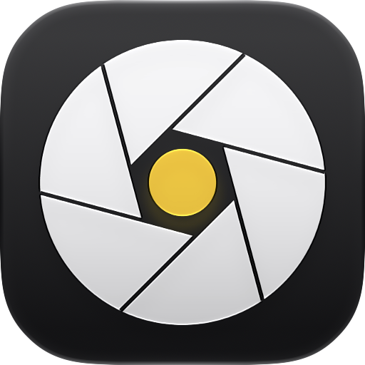

<p align="center">
  
</p>

<h1 align="center">TrueShot</h1>

<p align="center">
  A true-to-life RAW camera for iPhone: unprocessed Bayer DNGs, full manual control with
  real aperture, and optional looks that never touch the RAW.
</p>

---

## What it is

TrueShot captures **Bayer RAW (DNG)** straight from the sensor. There's no Deep Fusion, no Smart HDR,
no Night mode, no noise reduction, no sharpening and no digital zoom (`photoQualityPrioritization = .speed`,
physical lenses only). If you pick a look, TrueShot also develops a HEIC, and the untouched DNG is
attached to the same photo as its RAW original.

Built with SwiftUI and **Liquid Glass**, following Apple's Human Interface Guidelines. Swift 6 with strict concurrency.

## Features

**Capture**
- Bayer RAW DNG only, with an optional embedded preview. Photos shows it with a RAW badge.
- Physical lens switching (0.5× / 1× / tele), with labels derived from the device's own switch-over factors.
  Each lens's closest focus distance is shown (telephotos often can't focus much closer than ~1 m; TrueShot
  never secretly swaps to a cropped main lens), and manual focus resets per lens.
- **Flash: Off / Auto / On / Point & Shoot.** The flash LED fires as a short, metered burst:
  auto exposure settles on the lit scene, TrueShot's meter protects the lit subject's highlights (TTL-style),
  and the shot is taken at 1/60 s with the lowest ISO, so the light is real and in the RAW.
  Point & Shoot adds a film-like ISO 800 ceiling (only while the shutter is on auto). Your manual shutter/ISO are always kept.
- Volume buttons and **Camera Control** trigger the shutter. Camera Control also adjusts exposure, aperture, shutter, ISO and focus.

**Manual control, fine-grained**
- **Aperture** on iPhones with a variable-aperture lens, via iOS 27's
  `setExposureModeCustom(lensAperture:duration:iso:)`. Aperture, shutter and ISO can each be
  Auto or Manual on their own (aperture/shutter/ISO priority or full manual). Unsupported
  combinations are detected per lens and handled.
- Ruler dials with haptic ticks, in steps from **1/10 stop** to full stops. Aperture, shutter, ISO and exposure dials move in EV, so one step is the same amount of light on every dial.
- Manual focus (lens position), white balance (Kelvin + tint), and exposure compensation.

**Metering**
- TrueShot runs its own meter on top of Apple's auto exposure. It averages the middle 80% of the histogram
  to 18% middle grey, protects highlights at the 99th percentile (up to 1 stop), and uses a damped loop with
  anti-windup and stall detection so it doesn't hunt.
- Modes: Balanced, Center-Weighted, Spot (tap to meter), Highlight Priority (expose to the right) and Apple.

**Looks** (these only affect the HEIC; the DNG is never altered)
- 3D LUT filters with a live viewfinder preview, per-look intensity, and thumbnails of your current scene.
  **The repo ships no LUTs.** Bring your own `.cube` files (see below).
- **Film grain**: monochrome, strongest in the midtones, scaled to the image resolution, and moving in the viewfinder.
- **Date Stamp**: the orange seven-segment `'26 9 28` of 90s compact film cameras, from each photo's capture time.
- **Watermarks** filled from each photo's own metadata (camera model, lens, and the focal length, aperture,
  shutter and ISO actually used, plus the capture time). Styles: Light Bar, Dark Bar, Border and Overlay, with an optional signature.
  You can adjust the watermark on the real photo before saving.

**Lock Screen camera**
- A Control (with a custom aperture SF Symbol) for the **Lock Screen**, **Control Center** and **Action button**.
- A **Locked Camera Capture** extension runs TrueShot's full camera over the Lock Screen and saves to Photos while
  the phone is locked. The app hands its current settings to the extension through the capture intent's app context.

## Requirements

| | |
|---|---|
| Xcode | 27.1 or later (iOS 27 SDK) |
| iOS | 27.0 or later |
| Device | An iPhone with Bayer RAW support. **Aperture control** needs a lens with a variable aperture, and the app reads that from the hardware at runtime. |
| Tools | [XcodeGen](https://github.com/yonaskolb/XcodeGen) (`brew install xcodegen`); Python 3 + numpy only if you pack LUTs |
| Signing | A free or paid Apple ID in Xcode |

## Install (build from source)

TrueShot isn't on the App Store. Build and install it yourself:

```sh
git clone https://github.com/shrimpapplepro/TrueShot.git
cd TrueShot
```

1. **Set your bundle ID prefix.** In `project.yml`, change `BUNDLE_ID_PREFIX: com.thanhtu` to
   something of your own, e.g. `com.yourname`. Bundle IDs must be unique to your Apple ID.
2. **(Optional) Add LUTs.** See [Looks / LUTs](#looks--luts).
3. **Generate the Xcode project:**
   ```sh
   xcodegen generate
   ```
4. **Open and sign.** Open `TrueShot.xcodeproj`. For each of the three targets (**TrueShot**, **TrueShotControls**,
   **TrueShotCapture**), go to *Signing & Capabilities*, tick *Automatically manage signing*, and choose your team.
5. **Run.** Connect your iPhone, select it as the destination, and press **Run** (⌘R).
   The first time, enable *Developer Mode* on the phone (Settings › Privacy & Security) and trust your
   developer certificate (Settings › General › VPN & Device Management).

Or from the command line, after `xcodegen generate`:

```sh
xcodebuild -project TrueShot.xcodeproj -scheme TrueShot \
  -destination 'id=<your-device-udid>' \
  DEVELOPMENT_TEAM=<your-team-id> CODE_SIGN_STYLE=Automatic -allowProvisioningUpdates build
xcrun devicectl device install app --device <your-device-udid> \
  ~/Library/Developer/Xcode/DerivedData/TrueShot-*/Build/Products/Debug-iphoneos/TrueShot.app
```

(`xcrun devicectl list devices` shows your device's UDID.) Apps signed with a free Apple ID expire after 7 days; rebuild to refresh.

### Add it to the Lock Screen

Long-press the Lock Screen › **Customize** › **Lock Screen** › tap the bottom-right button › choose **TrueShot**.
The same control is available in Control Center (+ › TrueShot) and for the Action button (Settings › Action Button › Controls).
Open the app once after changing settings so the Lock Screen camera picks them up.

## Looks / LUTs

The filter library is local-only: `TrueShot/Resources/LUTs/` is git-ignored apart from its README.
Pack your own `.cube` 3D LUTs, meaning ones you made or have the right to use:

```sh
pip3 install numpy
python3 tools/pack_luts.py ~/path/to/my-cubes
xcodegen generate   # then rebuild
```

- The first folder level becomes a tab in the app, and the second level a group. Loose files go under "My LUTs".
- Each LUT is stored losslessly as a 16-bit PNG strip plus an entry in `catalog.json`.
- LUTs are applied in gamma-encoded sRGB, which is what most photo LUTs expect.
- Without LUTs the app works normally, and grain and watermarks don't need them.

## How it's built

| Path | What |
|---|---|
| `TrueShot/Camera/CaptureService.swift` | Capture actor (its executor *is* the session queue): session, lenses, exposure/focus/WB, Camera Control, metering loop, RAW capture and Photos saving |
| `TrueShot/Camera/Metering.swift` | Histogram metering and highlight protection |
| `TrueShot/Filters/` | LUT library and loader, live filtered viewfinder (Core Image → Metal), grain kernel, watermark renderer, RAW developer |
| `TrueShot/UI/` | SwiftUI + Liquid Glass UI: fine dials, parameter panels, filter browser, review sheet, settings |
| `Shared/` | `CameraCaptureIntent` shared by the app and both extensions |
| `Controls/` | Control widget and the custom `trueshot.aperture` symbol |
| `Capture/` | Locked Camera Capture extension (ExtensionKit, `com.apple.securecapture`) |
| `tools/pack_luts.py` | `.cube` → LUT library packer |
| `Design/icon/` | Icon source art and Liquid Glass renders |

Things this project learned the hard way:
- Photos pairs a HEIC with its DNG only when the DNG is added as a **file URL** (`shouldMoveFile`). Added as
  in-memory data with a UTI, it fails with `PHPhotosError` 3300.
- `CIRenderDestination` into a Metal texture needs `isFlipped = true`.
- The live preview is adaptively tone-mapped. A meter that reads it needs a deadband plus stall detection,
  or it slowly creeps.
- Custom SF Symbols must use the current template layout (`Ultralight-S`/`Regular-S`/`Black-S` with local
  coordinates). An old-style `Regular-M` file compiles fine but draws as a blank control.
- Xcode's `COMPRESS_PNG_FILES` would rewrite LUT PNGs, so it's disabled.
- With `AVCapturePhotoSettings.flashMode` on, the photo pipeline chooses its own exposure (about 1/6 s at base ISO),
  ignoring custom, locked, bias and max-duration settings. That's why TrueShot drives the LED as a torch burst and
  takes a normal capture, falling back to Apple's flash (with a developed-HEIC correction) only if that fails.

## License

MIT. See [LICENSE](LICENSE). This covers TrueShot's own code and artwork only. Any LUTs you pack are
subject to their own licenses.
